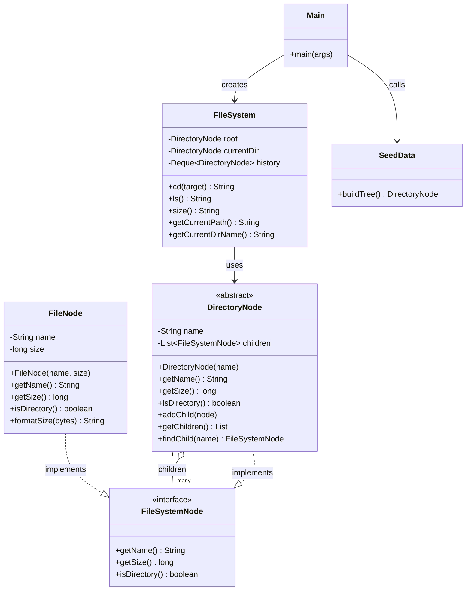

# Directory Size Calculator

A small Java CLI that lets you navigate a virtual file system and check directory sizes. Built mostly to practice tree traversal and OOP design.

## What it does

Simulates a file system, that can be traversed and queried for size and list directorires. Nothing is read from your actual disk - the tree is hardcoded in `SeedData.java`.

## Commands

| Command | What it does |
| --- | --- |
| `ls` | list contents of the current directory |
| `cd <name>` | move into a subdirectory |
| `cd ..` | go up one level |
| `cd /` | jump back to root |
| `size` | print the total size of the current directory (recursive) |
| `pwd` | show your current path |
| `help` | show available commands |
| `exit` | quit |

## Running it

Requires Java 17+ and Maven.

```bash
mvn compile exec:java
```

Or build a jar and run it:

```bash
mvn package
java -jar target/directory-size-calculator.jar
```

## Class diagram



## Project structure

```text
src/
  main/java/com/filesystem/
    Main.java            entry point, command loop
    FileSystem.java      navigation logic (cd, ls, size, pwd)
    FileSystemNode.java  base interface for nodes
    DirectoryNode.java   directory — holds children, computes recursive size
    FileNode.java        file — stores size, formats it for display
    SeedData.java        builds the example tree
  test/java/com/filesystem/
    FileSystemTest.java
```
